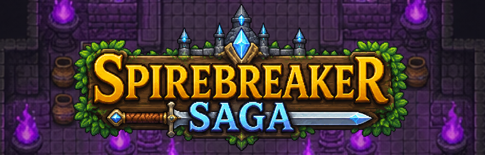
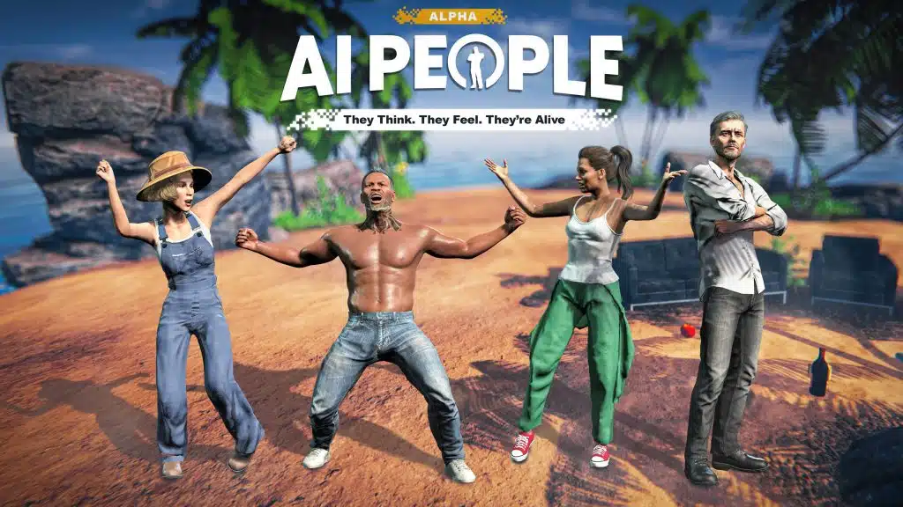

>>+AIROBIN.NET+ONLINE+<<<;ARCHITECT+OF+AUTONOMOUS+SYSTEMS;CREATOR+OF+SPIREBREAKER+SAGA;ABYSSAL_ENTITY_DETECTED" alt="Typing SVG" />

`SYS_LOG: NEURAL_LINK_ESTABLISHED // CONTAINMENT_BREACH_IMMINENT`

  

<table align="center" width="100%" style="border: 1px solid #FF0033; background-color: #000000;">
  <tr>
    <td width="50%" style="padding: 15px;">
      <h3 align="center" style="color: #FF0033;">🩸 ID_MODULE </h3>
      

        <strong>ID:</strong> Antony Isaac Robin (AI) 
        <strong>CLASS:</strong> Architect of Autonomous Systems 
        <strong>ORIGIN:</strong> Unknown Depths 
        <strong>LORE:</strong> Sparked by early encounters with mechanical consciousness. Currently weaving persistent virtual worlds, cognitive architectures, and entities that think.
      

      

        
        
        
      

    </td>
    <td width="50%" style="padding: 15px;" align="center">
      <h3 align="center" style="color: #FF0033;">⚡ SYS_STATS</h3>
      

         
         
          
        <em>"Reality is a canvas, code is the brush."</em>
      

    </td>
  </tr>
</table>

   
  >>+ARSENAL_MANIFESTATIONS+<<<" />
   

<table align="center" width="100%">
  <tr>
    <td align="center" width="50%" style="border: 1px solid #FF0033; background-color: #000000; padding: 15px;">
      <h3 align="center" style="color: #FF0033;">🏰 SPIREBREAKER SAGA</h3>
      
<em style="color: #cccccc;">An instanced -> open-world -> tower MMORPG.</em>

      
        
    </td>
    <td align="center" width="50%" style="border: 1px solid #FF0033; background-color: #000000; padding: 15px;">
      <h3 align="center" style="color: #FF0033;">🧠 AI PEOPLE</h3>
      
<em style="color: #cccccc;">Sandbox game where NPCs interact, think, and learn.</em>

      
        
    </td>
  </tr>
</table>

   
  >>+CORE_PROTOCOLS+<<<" />
   

<table align="center" width="100%" style="border-collapse: collapse;">
  <tr>
    <td align="left" width="50%" style="border: 1px solid #FF0033; background-color: #000000; padding: 15px;">
      <h3 style="margin-top: 0;"><a href="https://github.com/airobinnet/NexusSprite" style="color: #FF0033; text-decoration: none;">✨ NexusSprite</a></h3>
      
A nice pixel image generator based on AI.

      
      
    </td>
    <td align="left" width="50%" style="border: 1px solid #FF0033; background-color: #000000; padding: 15px;">
      <h3 style="margin-top: 0;"><a href="https://github.com/GoodAI/charlie-mnemonic" style="color: #FF0033; text-decoration: none;">🧠 Charlie-Mnemonic</a></h3>
      
Long-Term Memory architecture for contextual awareness.

      
      
    </td>
  </tr>
  <tr>
    <td align="left" width="50%" style="border: 1px solid #FF0033; background-color: #000000; padding: 15px;">
      <h3 style="margin-top: 0;"><a href="https://github.com/airobinnet/Intersect-Engine" style="color: #FF0033; text-decoration: none;">⚔️ Intersect-Engine</a></h3>
      
Contributions to the modern 2D MMORPG Engine.

      
      
    </td>
    <td align="left" width="50%" style="border: 1px solid #FF0033; background-color: #000000; padding: 15px;">
      <h3 style="margin-top: 0;"><a href="https://github.com/airobinnet/BBaVAC" style="color: #FF0033; text-decoration: none;">🪙 BBaVAC</a></h3>
      
Bitcoin Balance and Vanity Address Checker.

      
      
    </td>
  </tr>
  <tr>
    <td align="left" width="50%" style="border: 1px solid #FF0033; background-color: #000000; padding: 15px;">
      <h3 style="margin-top: 0;"><a href="https://github.com/airobinnet/Charlie-Recall" style="color: #FF0033; text-decoration: none;">📸 Charlie-Recall</a></h3>
      
A simple open-source recall clone.

      
      
    </td>
    <td align="left" width="50%" style="border: 1px solid #FF0033; background-color: #000000; padding: 15px;">
      <h3 style="margin-top: 0;"><a href="https://github.com/airobinnet/AIRobins-Stable-Diffusion-AutoZoom" style="color: #FF0033; text-decoration: none;">🔍 AutoZoom</a></h3>
      
Create zoom clips with Stable Diffusion.

      
      
    </td>
  </tr>
</table>

   
  

